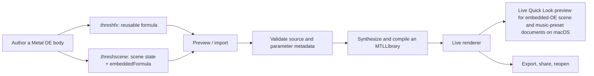

# Custom scenes and embedded distance estimators

Threshold's custom-scene format makes the distance estimator part of the
artwork. Instead of sending a scene that depends on a separately installed
shader, you can embed a small Metal source body in the scene itself. The app
validates it, compiles it into the existing renderer at runtime, and keeps all
the normal scene controls around it.

This guide is for a `kind: "fractal"` payload: a custom distance estimator.
`kind: "spaceWarp"` uses the same container but is a different extension point;
it changes the space feeding a built-in DE rather than defining the DE itself.
Older payloads may omit `kind`; Threshold treats those as fractal DEs for
backward compatibility.

## The portable workflow



Choose the packaging that matches the thing you want to share:

| File | Use it when | Formula placement |
| --- | --- | --- |
| `.threshfx` | You want to share a formula for reuse in several scenes. | `{ "version": 1, "formula": { ... } }` |
| `.threshscene` | You want to share a finished composition. | The normal scene data has an `embeddedFormula` property. |

A scene with an embedded formula retains its portable scene state—camera,
palette, lighting, environment, audio-reactive, space, and motion settings.
Gesture preferences remain local to a device; use a `.threshanim` document for a
keyframed timeline. Exporting the active custom scene keeps that formula
attached; exporting the formula creates a standalone `.threshfx` file.

On macOS, an embedded-DE `.threshscene` can also receive a live Quick Look
preview. A standalone `.threshfx` receives formula metadata in Quick Look; load
it in Threshold to render and edit it.

## Try the supplied examples

1. Build and run Threshold.
2. Custom scenes are available immediately; no beta or opt-in setting is required.
3. Open or import
   [`SampleSphereFold.threshfx`](Threshold/Examples/Formulas/SampleSphereFold.threshfx).
   It is the most approachable standalone example.
4. Then open a fully authored scene:

   - [`Accidental Sphere Projection.threshscene`](Threshold/Examples/Scenes/Accidental%20Sphere%20Projection.threshscene)
     — an embedded Mandelbox reconstruction with five controls.
   - [`Polychora 24-Cell.threshscene`](<Threshold/Examples/Custom%20Scene%20Example/Polychora%2024-Cell.threshscene>)
     — a richer 4D, stereographic-projection DE.
   - [`Newton Heightfield.threshscene`](Threshold/Examples/Scenes/Newton%20Heightfield.threshscene)
     — a different, terrain-like distance field.

On macOS or iPadOS, open **Shape → Fractal Formula → Metal DE Studio** to create
a formula or edit the active one. The editor parses parameter
comments immediately and compiles on a short debounce; if a new compile fails,
the last good shader remains rendered.

## What an embedded formula looks like

The following is the relevant fragment inside a `.threshscene`; it is not a
complete scene document. A standalone `.threshfx` places the same object under a
top-level `formula` key and adds `"version": 1`.

```jsonc
{
  "fractalType": "custom",
  "embeddedFormula": {
    "schemaVersion": 1,
    "kind": "fractal",
    "id": "org.example.threshold.starter-sphere",
    "name": "Starter Sphere",
    "category": "Custom",
    "author": "Your Name",
    "description": "A minimal embedded-DE example.",
    "functionStem": "StarterSphere",
    "metalSource": "...the Metal source below...",
    "params": [
      {
        "index": 0,
        "name": "Radius",
        "default": 1.0,
        "min": 0.05,
        "max": 4.0,
        "step": 0.01
      }
    ],
    "defaultIterations": 1,
    "defaultColorIterations": 1
  }
}
```

`functionStem` is used to form the two required functions. A simple analytic
sphere demonstrates the complete embedded-DE body:

```metal
// @param 0 "Radius" default=1 min=0.05 max=4 step=0.01

// Called for every ray-march step. Keep this version lean.
FORCE_INLINE float DE_StarterSphere_Dist(float3 pos, FormulaParams fp,
                                         float3x3 rot, int iterations) {
    (void)rot;
    (void)iterations;
    return length(pos) - max(fp.params[0], 0.001f);
}

// Called where Threshold needs orbit data for coloring. Keep its geometry
// equivalent to DE_StarterSphere_Dist and populate every OrbitData field.
FORCE_INLINE float DE_StarterSphere(float3 pos, FormulaParams fp,
                                    float3x3 rot, int iterations,
                                    int colorIterations,
                                    thread OrbitData& orbit) {
    (void)colorIterations;
    float d = DE_StarterSphere_Dist(pos, fp, rot, iterations);
    orbit.trap = dot(pos, pos);
    orbit.trapIteration = 0;
    orbit.trapPosition = pos;
    orbit.finalP = pos;
    orbit.iterationsUsed = 1;
    return d;
}
```

Threshold provides `FormulaParams`, `OrbitData`, `FORCE_INLINE`, the rotation
matrix passed as `rot`, and shared helpers such as `hasRot1Precomputed(fp)`.
Do not redeclare them. Formula parameters read from `fp.params[0]` through
`fp.params[15]`; the `params` metadata turns those slots into named controls.

The `// @param` comments are the live editor's source-of-truth for control
declarations. They are ordinary Metal comments, so they are safe to keep in the
source. When hand-authoring a `.threshfx`, keep the JSON `params` array aligned
with those comments; saving through Metal DE Studio writes the matching metadata
for you.

## Contract and limits

The runtime compiler is deliberately narrow. It compiles a formula body inside
Threshold's renderer rather than accepting a general Metal project.

- Use a nonempty, stable `id`; choose a `functionStem` matching
  `[A-Za-z_][A-Za-z0-9_]*`.
- Provide both `DE_<Stem>_Dist(float3, FormulaParams, float3x3, int)` and
  `DE_<Stem>(float3, FormulaParams, float3x3, int, int, thread OrbitData&)`.
  Both must return the same underlying distance field. The orbit-aware function
  must set `trap`, `trapIteration`, `trapPosition`, `finalP`, and
  `iterationsUsed`.
- Keep `metalSource` at or below 64 KiB. `#include`, `#import`, and `@import`
  are rejected, so put the formula body directly in the payload.
- Use unique parameter indexes from `0` through `15`. The renderer passes these
  values every frame, so changing a value does not require recompiling the DE.
- Runtime compilation is asynchronous and cached in memory for the current
  renderer session. The first activation may take a few seconds.
- Keep work bounded: the DE runs repeatedly while ray marching. Guard divisions,
  avoid undefined values, and begin with modest iteration counts.

The host applies its domain transforms and DE scale around the custom formula.
The formula should therefore describe its own object or fractal field—not try to
recreate the app's complete renderer or include external shader files.

## Test an authored formula

Before sharing a custom scene, import it on the target device and test a save,
reopen, and export cycle. For repository changes, run:

```sh
Scripts/build.sh test
Scripts/build.sh mac
```

The clean test suite decodes every shipped example and compiles every bundled
formula and embedded DE in the scene/preset example directories through the
production runtime compiler. For Metal or Quick Look changes, also run
`Scripts/build.sh embeds`, `Scripts/build.sh vision`, and
`Scripts/ql_render_check.sh` as described in [CONTRIBUTING.md](CONTRIBUTING.md).

## Common failures

| Symptom | Check |
| --- | --- |
| The scene refuses to load. | Make sure the payload is a fractal DE (`kind: "fractal"` or legacy omitted `kind`), not `kind: "spaceWarp"`, and check the validation/compiler error. |
| The compiler says a DE is missing. | The function stem and both required names must match exactly. |
| The formula compiles but coloring looks wrong. | Ensure the full DE writes every `OrbitData` field and uses the same geometry as the `_Dist` variant. |
| A file works locally but not after sharing. | Export the `.threshscene` with its active formula embedded, or share the `.threshfx` alongside the scene. |
