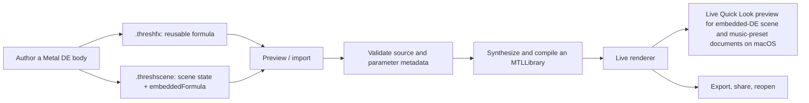

# Custom scenes and embedded distance estimators

Threshold's custom-scene format makes the distance estimator part of the
artwork. Instead of sending a scene that depends on a separately installed
shader, you can embed a small Metal source body in the scene itself. The app
validates it, compiles it into the existing renderer at runtime, and keeps all
the normal scene controls around it.

This guide is for a `kind: "fractal"` payload: a custom distance estimator.
`kind: "spaceWarp"` uses the same container but is a different extension point;
it changes the space feeding a built-in DE rather than defining the DE itself.
`kind: "lighting"` is an additive material modifier: it rides any fractal and
requests base-colour, specular, or emission changes while Threshold keeps
ownership of its lighting and post-processing stack.
Older payloads may omit `kind`; Threshold treats those as fractal DEs for
backward compatibility.

## The portable workflow



Choose the packaging that matches the thing you want to share:

| File | Use it when | Formula placement |
| --- | --- | --- |
| `.threshfx` | You want to share a formula for reuse in several scenes. | `{ "version": 1, "formula": { ... } }` |
| `.threshscene` | You want to share a finished composition. | The normal scene data has an `embeddedFormula` property. |

A scene with an embedded formula retains its portable scene state—camera,
palette, lighting, environment, audio-reactive, space, and motion settings.
Gesture preferences remain local to a device; use a `.threshanim` document for a
keyframed timeline. Exporting the active custom scene keeps that formula
attached; exporting the formula creates a standalone `.threshfx` file.

On macOS, an embedded-DE `.threshscene` can also receive a live Quick Look
preview. A standalone `.threshfx` receives formula metadata in Quick Look; load
it in Threshold to render and edit it.

## Try the supplied examples

1. Build and run Threshold.
2. In **Settings → Display → Experimental Display**, enable **Allow custom
   scenes**. This is off by default because a user-supplied Metal source must be
   compiled at runtime.
3. For a deterministic lighting check, stay in **Experimental Display** and
   choose **Load Lighting Demo**. The current visible fractal should become
   vivid cyan/magenta with a bright emissive rim; a status chip says
   **Compiling** first and **Custom lighting active** only after Metal publishes
   the effect. The **Imported Lighting** card then exposes live sliders and
   switches; try **Tint Strength** or **Rim Emission** for an immediate A/B test.
   Switch among built-in fractals to verify that both the effect and its control
   values remain attached, then use the chip's × or **Detach Lighting** for a
   comparison with Threshold's unmodified material.
4. To exercise the external-author flow, choose **Import .threshfx…** beside the
   demo and select
   [`IridescentRimLighting.threshfx`](Threshold/Examples/Formulas/IridescentRimLighting.threshfx)
   or your own `kind: "lighting"` file. A standalone DE such as
   [`SampleSphereFold.threshfx`](Threshold/Examples/Formulas/SampleSphereFold.threshfx)
   uses the same importer but follows the custom-fractal preview flow. A domain
   modifier such as
   [`Voronoi3DFieldSpaceWarp.threshfx`](Threshold/Examples/Formulas/Voronoi3DFieldSpaceWarp.threshfx)
   is decoded from disk and runtime-compiled into the external `spaceWarp` slot,
   applying immediately to the current fractal. The same real container is
   available in **Shape → Transformations → Add → External Modifiers**; it appears
   as a global `.threshfx` card because v1 external warps temporarily override
   (but do not erase) the ordered built-in transformation stack.
5. Then open a fully authored scene:

   - [`Accidental Sphere Projection.threshscene`](Threshold/Examples/Scenes/Accidental%20Sphere%20Projection.threshscene)
     — an embedded Mandelbox reconstruction with five controls.
   - [`Polychora 24-Cell.threshscene`](<Threshold/Examples/Custom%20Scene%20Example/Polychora%2024-Cell.threshscene>)
     — a richer 4D, stereographic-projection DE.
   - [`Newton Heightfield.threshscene`](Threshold/Examples/Scenes/Newton%20Heightfield.threshscene)
     — a different, terrain-like distance field.

On macOS, enable the feature and open **Shape → Fractal Formula → Metal DE
Studio** to create a formula or edit the active one. The editor parses parameter
comments immediately and compiles on a short debounce; if a new compile fails,
the last good shader remains rendered.

## What an embedded formula looks like

The following is the relevant fragment inside a `.threshscene`; it is not a
complete scene document. A standalone `.threshfx` places the same object under a
top-level `formula` key and adds `"version": 1`.

```jsonc
{
  "fractalType": "custom",
  "embeddedFormula": {
    "schemaVersion": 1,
    "kind": "fractal",
    "id": "org.example.threshold.starter-sphere",
    "name": "Starter Sphere",
    "category": "Custom",
    "author": "Your Name",
    "description": "A minimal embedded-DE example.",
    "functionStem": "StarterSphere",
    "metalSource": "...the Metal source below...",
    "params": [
      {
        "index": 0,
        "name": "Radius",
        "default": 1.0,
        "min": 0.05,
        "max": 4.0,
        "step": 0.01
      }
    ],
    "defaultIterations": 1,
    "defaultColorIterations": 1
  }
}
```

`functionStem` is used to form the two required functions. A simple analytic
sphere demonstrates the complete embedded-DE body:

```metal
// @param 0 "Radius" default=1 min=0.05 max=4 step=0.01

// Called for every ray-march step. Keep this version lean.
FORCE_INLINE float DE_StarterSphere_Dist(float3 pos, FormulaParams fp,
                                         float3x3 rot, int iterations) {
    (void)rot;
    (void)iterations;
    return length(pos) - max(fp.params[0], 0.001f);
}

// Called where Threshold needs orbit data for coloring. Keep its geometry
// equivalent to DE_StarterSphere_Dist and populate every OrbitData field.
FORCE_INLINE float DE_StarterSphere(float3 pos, FormulaParams fp,
                                    float3x3 rot, int iterations,
                                    int colorIterations,
                                    thread OrbitData& orbit) {
    (void)colorIterations;
    float d = DE_StarterSphere_Dist(pos, fp, rot, iterations);
    orbit.trap = dot(pos, pos);
    orbit.trapIteration = 0;
    orbit.trapPosition = pos;
    orbit.finalP = pos;
    orbit.iterationsUsed = 1;
    return d;
}
```

Threshold provides `FormulaParams`, `OrbitData`, `FORCE_INLINE`, the rotation
matrix passed as `rot`, and shared helpers such as `hasRot1Precomputed(fp)`.
Do not redeclare them. Formula parameters read from `fp.params[0]` through
`fp.params[15]`; the `params` metadata turns those slots into named controls.

The `// @param` comments are the live editor's source-of-truth for control
declarations. They are ordinary Metal comments, so they are safe to keep in the
source. When hand-authoring a `.threshfx`, keep the JSON `params` array aligned
with those comments; saving through Metal DE Studio writes the matching metadata
for you.

## Contract and limits

The runtime compiler is deliberately narrow. It compiles a formula body inside
Threshold's renderer rather than accepting a general Metal project.

- Use a nonempty, stable `id`; choose a `functionStem` matching
  `[A-Za-z_][A-Za-z0-9_]*`.
- Provide both `DE_<Stem>_Dist(float3, FormulaParams, float3x3, int)` and
  `DE_<Stem>(float3, FormulaParams, float3x3, int, int, thread OrbitData&)`.
  Both must return the same underlying distance field. The orbit-aware function
  must set `trap`, `trapIteration`, `trapPosition`, `finalP`, and
  `iterationsUsed`.
- Keep the complete `.threshfx` document at or below 512 KiB and `metalSource`
  at or below 64 KiB. Preprocessor directives (all `#` syntax) and `@import`
  are rejected, so put the formula body directly in the payload.
- Use unique parameter indexes from `0` through `15`. The renderer passes these
  values every frame, so changing a value does not require recompiling the DE.
- Runtime compilation is asynchronous and cached in memory for the current
  renderer session. The first activation may take a few seconds.
- Keep work bounded: the DE runs repeatedly while ray marching. Guard divisions,
  avoid undefined values, and begin with modest iteration counts.

The host applies its domain transforms and DE scale around the custom formula.
The formula should therefore describe its own object or fractal field—not try to
recreate the app's complete renderer or include external shader files.

## Custom lighting material hook and live controls

A lighting `.threshfx` uses the same container, with `"kind": "lighting"`, a
`params` array, and one stem-scoped function. The descriptors create controls in
the **Imported Lighting** card; the Metal body reads their current values through
`thresholdLightingParam(context, index)`:

```metal
// @param 0 "Specular Strength" default=2 min=0 max=8 step=0.05
// @param 1 "Animate Rim" default=1 min=0 max=1 step=1 bool

FORCE_INLINE ThresholdMaterial Lighting_MyHighlight(
    ThresholdLightingContext context,
    ThresholdMaterial material)
{
    float specularStrength = thresholdLightingParam(context, 0u);
    float animateRim = thresholdLightingParam(context, 1u);
    float facing = saturate(dot(context.normal, context.viewDirection));
    float pulse = mix(1.0f,
                      0.65f + 0.35f * sin(context.animationTime * 2.0f),
                      animateRim);
    material.specularTint = half3(0.35h, 0.75h, 1.0h);
    material.specularScale = specularStrength;
    material.specularPower = 120.0f;
    material.emission += half3(powr(1.0f - facing, 3.0f) * 0.05f * pulse);
    return material;
}
```

Set `functionStem` to `MyHighlight`, so the required entry point is
`Lighting_MyHighlight`. In the surrounding `.threshfx` JSON, mirror those
declarations as parameter metadata:

```jsonc
"params": [
  {
    "index": 0,
    "name": "Specular Strength",
    "default": 2.0,
    "min": 0.0,
    "max": 8.0,
    "step": 0.05
  },
  {
    "index": 1,
    "name": "Animate Rim",
    "default": 1.0,
    "min": 0.0,
    "max": 1.0,
    "step": 1.0,
    "isBool": true
  }
]
```

The general source declaration is:

```metal
// @param <index> "<label>" default=<number> min=<number> max=<number> step=<positive-number> [bool] [hidden]
```

The imported JSON `params` array is the runtime control metadata; `// @param`
pragmas keep the same declaration beside the Metal code and are the live
editor's source format. When hand-authoring a `.threshfx`, keep both forms in
sync. `bool` corresponds to `"isBool": true` and renders a switch whose shader
value is `0.0` or `1.0`. `hidden` corresponds to `"isHidden": true`; it reserves
and persists the slot but omits the control from the UI.

Each effect has at most 16 unique scalar slots, indexed `0` through `15`.
Descriptors must use finite numbers, a nonempty name, `min < max`, a default
inside the range, and a positive step. A Boolean range must contain both `0`
and `1`. Sparse indexes are allowed; undeclared slots read as zero. Threshold
clamps loaded values to their declared ranges and normalizes Boolean values.

The input material starts with Threshold's orbit-derived base colour and its
current specular power. Authors may modify:

| Field | Meaning |
| --- | --- |
| `baseColor` | Surface colour before Threshold applies diffuse, sun, and ambient terms. |
| `specularTint` | Tint for Threshold's single specular calculation. |
| `emission` | Linear colour added after host lighting, before fog/glow/post. |
| `diffuseScale` | Multiplier for both Threshold diffuse lights. |
| `ambientScale` | Multiplier for Threshold ambient/AO. |
| `specularScale` | Multiplier for Threshold specular; set to `0` to suppress it. |
| `specularPower` | Highlight exponent: larger values make a tighter highlight. |

The context supplies `position`, `normal`, `viewDirection`, `spotDirection`,
`sunDirection`, their intensity/attenuation values, both shadow values,
`hostSpecularPower`, and `animationTime`. Returned values are finite-checked and
clamped before use.

`thresholdLightingParam(context, index)` reads a dedicated, host-owned 16-float
lighting bank. It is intentionally separate from the geometry formula's
`FormulaParams` / `fp.params` bank: a custom DE and custom lighting can use the
same numeric indexes without collision. Moving a lighting slider or switch
updates that bank in the frame uniforms immediately. It does not change the
source hash, invoke the Metal compiler, or rebuild the render pipeline. Editing
the Metal body or its declarations and reimporting the `.threshfx` still requires
normal validation and compilation.

The lighting sidecar and its values survive a switch between built-in and custom
fractals, so one material effect can be tuned once and compared across geometry.
**Reset Controls** restores its descriptor defaults without resetting the
fractal's parameters or Threshold's own lighting settings. **Detach Lighting**
removes only the sidecar.

This boundary intentionally does **not** return the final pixel. Threshold still
computes diffuse light, shadows, AO, cel shading, fog, glow, bloom, and tone
mapping once, which prevents an imported effect from accidentally doubling the
app's specular highlight or bypassing its lighting system.

When a scene is saved, lighting is stored separately as `embeddedLighting` and
its current control bank as `embeddedLightingParamValues`. A scene may therefore
carry custom geometry/warp and custom lighting—with independent parameter
values—at the same time. Missing value banks resolve to descriptor defaults, so
older parameterless scenes and `.threshfx` distance estimators remain compatible.
A standalone `.threshfx` carries declarations and defaults, not the current
scene's live control values.

Current control limitations:

- Parameters are uniform scalar floats or Boolean switches. There are no native
  colour, vector, enum, text, texture, curve, or grouped controls yet.
- Lighting parameters are not currently gesture- or music-reactive targets.
- Threshold's **Cell Shading** path does not run the continuous specular term;
  `specularTint`, `specularScale`, and `specularPower` controls therefore affect
  the standard lighting path, while base-colour and emission changes remain
  visible in either mode.
- The 16-slot limit includes hidden parameters, and parameter indexes are the
  stable persistence keys; changing their meaning can change the look of saved
  scenes that use the effect.
- Controls modify the material hook only. They cannot replace Threshold's final
  lighting, shadow, fog, glow, bloom, or tone-mapping passes, load external
  shader files, or supply a final pixel colour.

## Test an authored formula

Before sharing a custom scene, import it on the target device and test a save,
reopen, and export cycle. For repository changes, run:

```sh
Scripts/build.sh test
Scripts/build.sh mac
```

The clean test suite decodes every shipped example and compiles every bundled
formula and embedded DE in the scene/preset example directories through the
production runtime compiler. For Metal or Quick Look changes, also run
`Scripts/build.sh embeds`, `Scripts/build.sh vision`, and
`Scripts/ql_render_check.sh` as described in [CONTRIBUTING.md](CONTRIBUTING.md).

## Common failures

| Symptom | Check |
| --- | --- |
| The scene refuses to load. | Enable **Allow custom scenes** and verify that `kind` matches the functions supplied: a DE pair for `fractal`, the custom-warp pair for `spaceWarp`, or `Lighting_<stem>` for `lighting`. |
| The compiler says a DE is missing. | The function stem and both required names must match exactly. |
| The formula compiles but coloring looks wrong. | Ensure the full DE writes every `OrbitData` field and uses the same geometry as the `_Dist` variant. |
| A file works locally but not after sharing. | Export the `.threshscene` with its active formula embedded, or share the `.threshfx` alongside the scene. |
