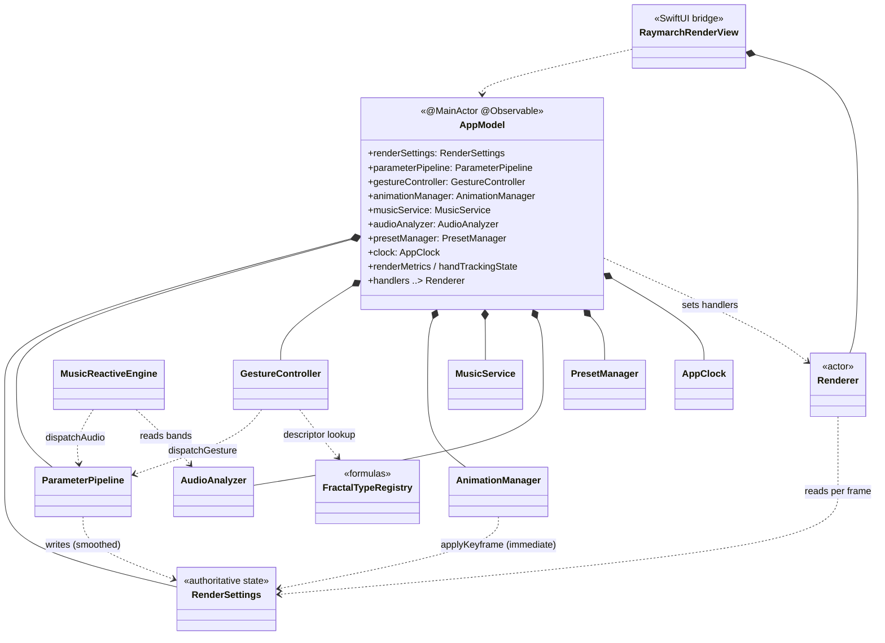
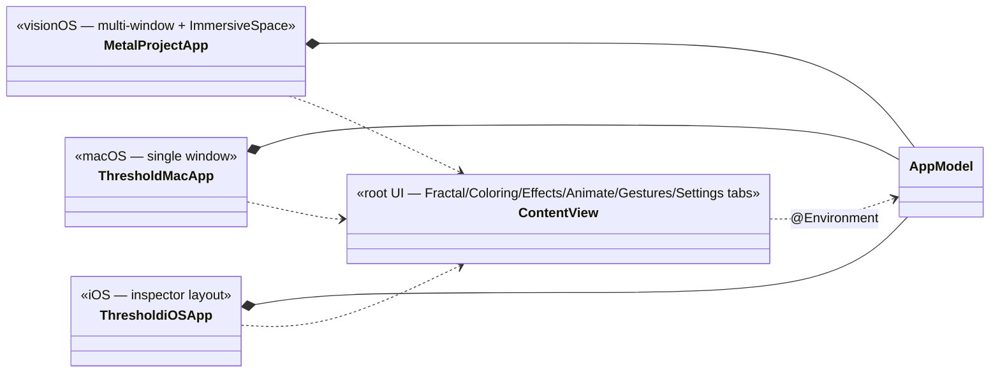
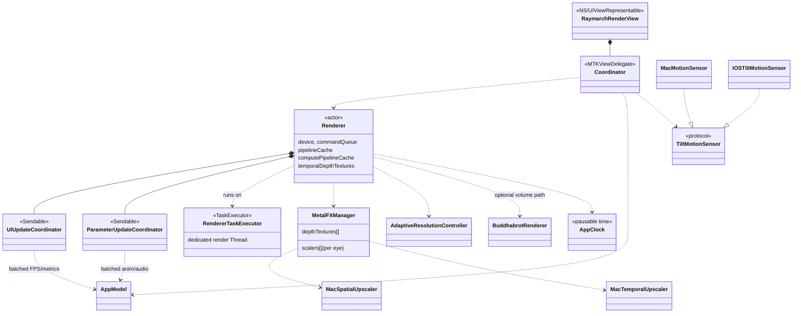
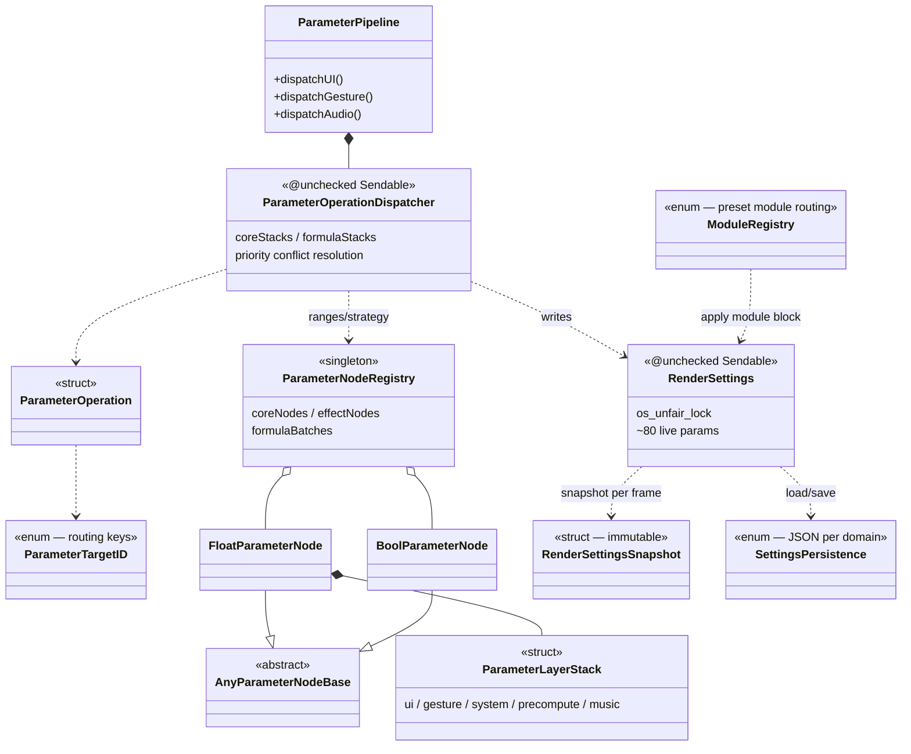
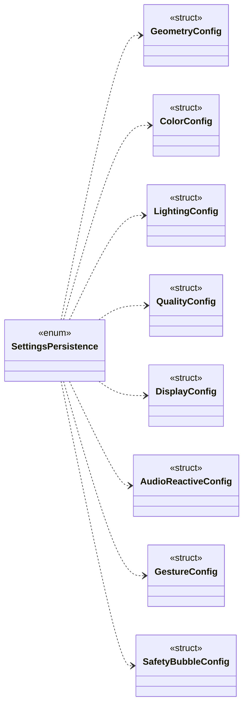
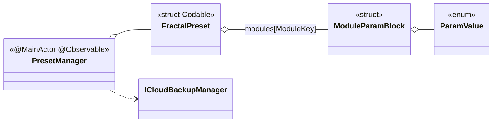
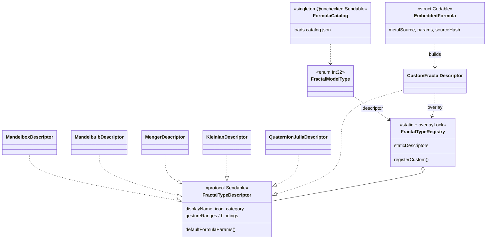
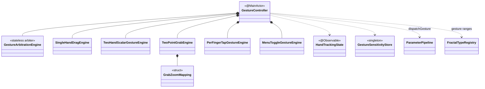
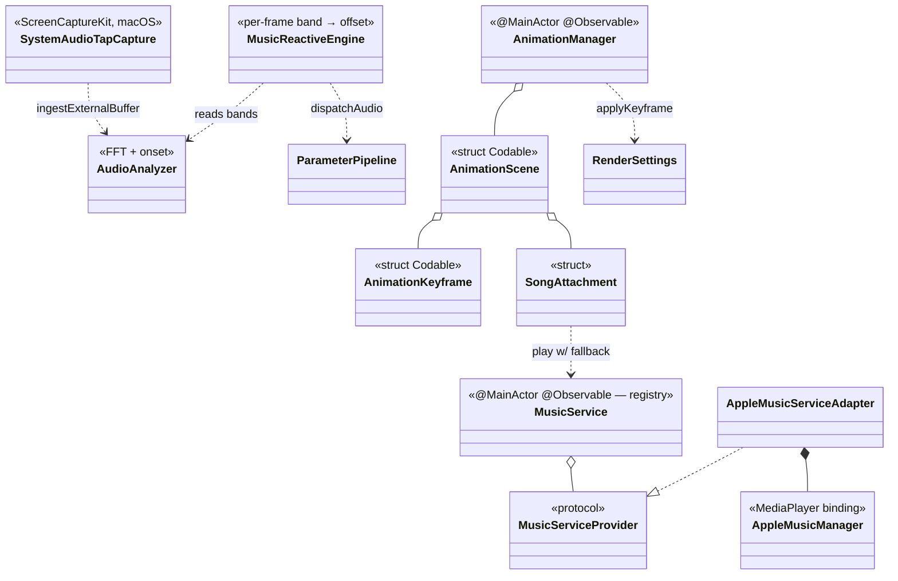

# Threshold — Architecture UML

A UML class-diagram view of the Threshold fractal raymarching app, organized by subsystem.
Diagrams use [Mermaid](https://mermaid.js.org/) and render natively on GitHub.

### Notation legend

| Arrow | UML meaning | Reads as |
|-------|-------------|----------|
| `A *-- B` | composition | A **owns** B (strong, lifetime-bound) |
| `A o-- B` | aggregation | A **holds** B (shared / collection) |
| `A ..> B` | dependency | A **uses / calls** B |
| `B ..\|> A` | realization | B **implements protocol** A |
| `B --\|> A` | inheritance | B **subclasses** A |

Stereotypes (`<<actor>>`, `<<protocol>>`, `<<struct>>`, `<<enum>>`, `<<singleton>>`) mark the Swift kind.

---

## 1. System overview

`AppModel` is the `@MainActor @Observable` hub: it owns every subsystem and wires render-thread
callbacks (`handlers`) into the `Renderer` actor. Data flows **input → parameters → render → UI**.



**Three platform entry points** each create one `AppModel`:



---

## 2. Rendering subsystem

`Renderer` is an `actor` split across many `Renderer*.swift` extensions in `Rendering/Core/`. It runs
on a dedicated thread (`RendererTaskExecutor`) and offloads upscaling to MetalFX. The SwiftUI bridge
(`RaymarchRenderView` + `Coordinator`) connects it to the view hierarchy.



---

## 3. Parameters & state subsystem

The heart of the app. A **two-path dispatch** model: UI sliders flow through per-parameter
`FloatParameterNode` layer stacks; gesture/audio/animation flow through the
`ParameterOperationDispatcher`'s core/formula stacks. Both resolve into `RenderSettings`, the single
lock-protected authority the renderer reads each frame.



Config domains are `Codable` value types persisted by `SettingsPersistence`, hydrated into
`RenderSettings`:



Presets persist a whole scene; v2 adds typed module blocks routed by `ModuleRegistry`:



---

## 4. Formulas subsystem

A protocol-oriented registry. Each fractal is a `struct` conforming to `FractalTypeDescriptor`;
`FractalTypeRegistry` resolves them by `rawValue`, with a lock-protected overlay for runtime-loaded
custom formulas (`EmbeddedFormula` → `CustomFractalDescriptor`).



---

## 5. Gestures subsystem

`GestureController` (`@MainActor`) owns every engine, pulls ARKit hand data each frame, and dispatches
recognized operations to `ParameterPipeline`. `GestureArbitrationEngine` resolves one-hand vs two-hand
conflicts.



---

## 6. Audio & animation subsystems

Music backends sit behind the `MusicServiceProvider` protocol (adapter pattern).
`AudioAnalyzer` does FFT + spectral-flux onset detection; `MusicReactiveEngine` converts band levels
into additive parameter offsets. `AnimationManager` plays keyframed scenes, writing immediate values
into `RenderSettings`. Audio (additive) and animation (base) compose.



---

## Cross-cutting data flow

```
Input (gesture / tilt / tap)
        │  dispatchGesture
        ▼
ParameterPipeline ──► ParameterOperationDispatcher ──► RenderSettings ◄── reads ── Renderer ──► GPU
        ▲                                                   ▲
        │ dispatchAudio                                     │ applyKeyframe (immediate)
MusicReactiveEngine ◄── bands ── AudioAnalyzer        AnimationManager
        ▲                                                   ▲
   SystemAudioTapCapture / AppleMusicManager           AnimationScene/Keyframe

Renderer ──► UIUpdateCoordinator ──► AppModel.renderMetrics ──► SwiftUI (ContentView)
```
