# Threshold — Class Diagram

A **true UML class diagram** (full attribute + method compartments) extracted from source, split per
subsystem so each block stays legible. Renders as [Mermaid](https://mermaid.js.org/) on GitHub.

### Reading these diagrams

- Visibility: `+` public/internal · `-` private · `#` fileprivate
- Stereotypes: `<<actor>>` `<<protocol>>` `<<struct>>` `<<enumeration>>` (classes have none)
- Relationship arrows:
  - `A <|-- B` — B **subclasses** A · `A <|.. B` — B **conforms to protocol** A
  - `A *-- B` — A **owns** B (composition) · `A o-- B` — A **aggregates** B
  - `A ..> B` — A **uses/depends on** B
- **Notation choices forced by Mermaid:** Swift generics `<…>` are written `~…~` (e.g. `Mutex~State~`,
  `SIMD3~Float~`, `Dictionary~String, Float~`). Closure-typed properties (handlers) are shown as
  attributes with a simplified type since Mermaid reads `()` as a method.
- Large types (e.g. `RenderSettings` has ~150 backing fields) show **representative members grouped by
  domain** with a `… (+N more)` marker — standard UML for god-objects.

**Index** — [1 App hub](#1-app-hub) · [2 Parameters core](#2-parameter-dispatch-core) ·
[3 State & config](#3-state--config) · [4 Rendering](#4-rendering) · [5 Gestures](#5-gestures) ·
[6 Audio](#6-audio) · [7 Animation](#7-animation) · [8 Formulas](#8-formulas)

---

## 1. App hub

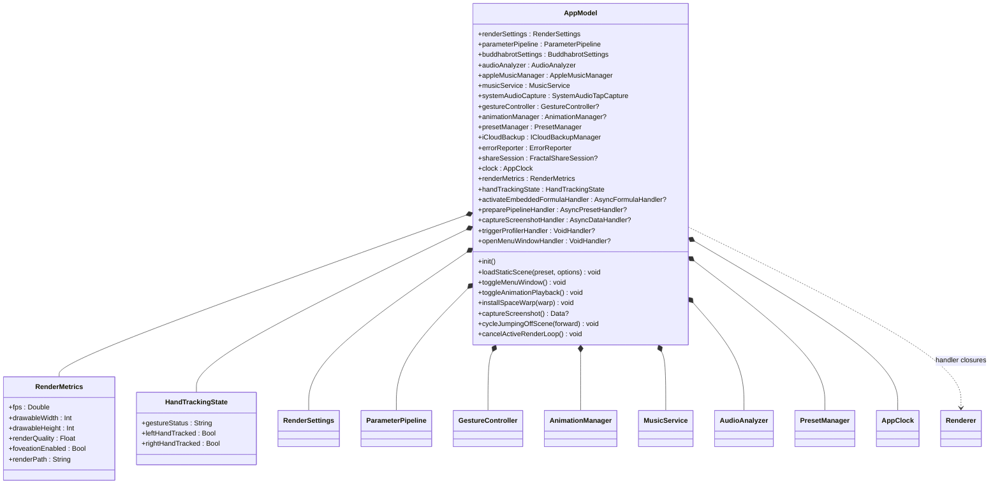
```mermaid
classDiagram
    direction TB

    class AppModel {
        +renderSettings : RenderSettings
        +parameterPipeline : ParameterPipeline
        +buddhabrotSettings : BuddhabrotSettings
        +audioAnalyzer : AudioAnalyzer
        +appleMusicManager : AppleMusicManager
        +musicService : MusicService
        +systemAudioCapture : SystemAudioTapCapture
        +gestureController : GestureController?
        +animationManager : AnimationManager?
        +presetManager : PresetManager
        +iCloudBackup : ICloudBackupManager
        +errorReporter : ErrorReporter
        +shareSession : FractalShareSession?
        +clock : AppClock
        +renderMetrics : RenderMetrics
        +handTrackingState : HandTrackingState
        +activateEmbeddedFormulaHandler : AsyncFormulaHandler?
        +preparePipelineHandler : AsyncPresetHandler?
        +captureScreenshotHandler : AsyncDataHandler?
        +triggerProfilerHandler : VoidHandler?
        +openMenuWindowHandler : VoidHandler?
        +init()
        +loadStaticScene(preset, options) void
        +toggleMenuWindow() void
        +toggleAnimationPlayback() void
        +installSpaceWarp(warp) void
        +captureScreenshot() Data?
        +cycleJumpingOffScene(forward) void
        +cancelActiveRenderLoop() void
    }
    class RenderMetrics {
        +fps : Double
        +drawableWidth : Int
        +drawableHeight : Int
        +renderQuality : Float
        +foveationEnabled : Bool
        +renderPath : String
    }
    class HandTrackingState {
        +gestureStatus : String
        +leftHandTracked : Bool
        +rightHandTracked : Bool
    }

    AppModel *-- RenderMetrics
    AppModel *-- HandTrackingState
    AppModel *-- RenderSettings
    AppModel *-- ParameterPipeline
    AppModel *-- GestureController
    AppModel *-- AnimationManager
    AppModel *-- MusicService
    AppModel *-- AudioAnalyzer
    AppModel *-- PresetManager
    AppModel *-- AppClock
    AppModel ..> Renderer : handler closures
```
`RenderMetrics` / `HandTrackingState` are separate `@Observable` sub-containers so high-frequency
render-thread updates don't invalidate the whole `AppModel`. The `*Handler` closures are set by the
`Renderer` at startup — the only back-channel from the actor to the main-actor model.

---

## 2. Parameter dispatch core

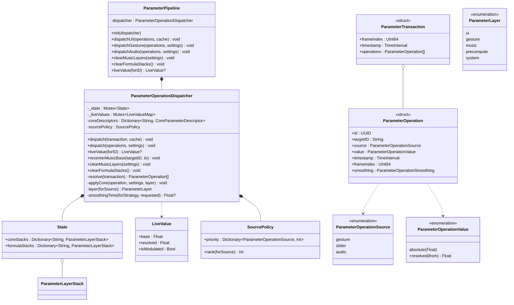
```mermaid
classDiagram
    direction TB

    class ParameterPipeline {
        -dispatcher : ParameterOperationDispatcher
        +init(dispatcher)
        +dispatchUI(operations, cache) void
        +dispatchGesture(operations, settings) void
        +dispatchAudio(operations, settings) void
        +clearMusicLayers(settings) void
        +clearFormulaStacks() void
        +liveValue(forID) LiveValue?
    }
    class ParameterOperationDispatcher {
        -_state : Mutex~State~
        -_liveValues : Mutex~LiveValueMap~
        -coreDescriptors : Dictionary~String, CoreParameterDescriptor~
        -sourcePolicy : SourcePolicy
        +dispatch(transaction, cache) void
        +dispatch(operations, settings) void
        +liveValue(forID) LiveValue?
        +recenterMusicBase(targetID, to) void
        +clearMusicLayers(settings) void
        +clearFormulaStacks() void
        -resolve(transaction) ParameterOperation[]
        -applyCore(operation, settings, layer) void
        -layer(forSource) ParameterLayer
        -smoothingTime(forStrategy, requested) Float?
    }
    class State {
        +coreStacks : Dictionary~String, ParameterLayerStack~
        +formulaStacks : Dictionary~String, ParameterLayerStack~
    }
    class LiveValue {
        +base : Float
        +resolved : Float
        +isModulated : Bool
    }
    class SourcePolicy {
        +priority : Dictionary~ParameterOperationSource, Int~
        +rank(forSource) Int
    }
    class ParameterOperation {
        <<struct>>
        +id : UUID
        +targetID : String
        +source : ParameterOperationSource
        +value : ParameterOperationValue
        +timestamp : TimeInterval
        +frameIndex : UInt64
        +smoothing : ParameterOperationSmoothing
    }
    class ParameterTransaction {
        <<struct>>
        +frameIndex : UInt64
        +timestamp : TimeInterval
        +operations : ParameterOperation[]
    }
    class ParameterOperationSource {
        <<enumeration>>
        gesture
        slider
        audio
    }
    class ParameterOperationValue {
        <<enumeration>>
        absolute(Float)
        +resolved(from) Float
    }
    class ParameterLayer {
        <<enumeration>>
        ui
        gesture
        music
        precompute
        system
    }

    ParameterPipeline *-- ParameterOperationDispatcher
    ParameterOperationDispatcher *-- State
    ParameterOperationDispatcher *-- SourcePolicy
    ParameterOperationDispatcher ..> LiveValue
    ParameterTransaction o-- ParameterOperation
    ParameterOperation ..> ParameterOperationSource
    ParameterOperation ..> ParameterOperationValue
    State o-- ParameterLayerStack
```

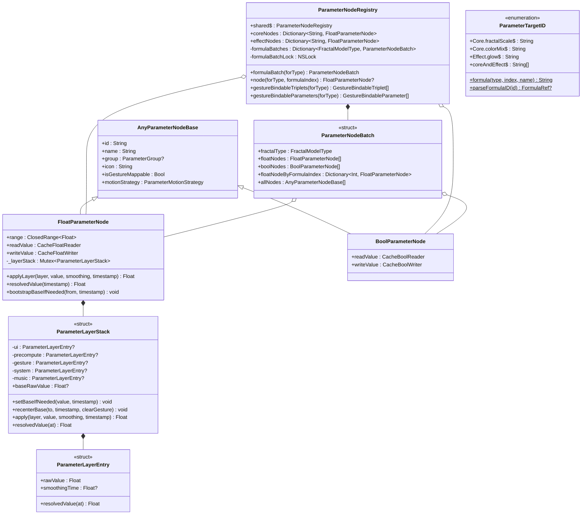
```mermaid
classDiagram
    direction TB

    class AnyParameterNodeBase {
        +id : String
        +name : String
        +group : ParameterGroup?
        +icon : String
        +isGestureMappable : Bool
        +motionStrategy : ParameterMotionStrategy
    }
    class FloatParameterNode {
        +range : ClosedRange~Float~
        +readValue : CacheFloatReader
        +writeValue : CacheFloatWriter
        -_layerStack : Mutex~ParameterLayerStack~
        +applyLayer(layer, value, smoothing, timestamp) Float
        +resolvedValue(timestamp) Float
        +bootstrapBaseIfNeeded(from, timestamp) void
    }
    class BoolParameterNode {
        +readValue : CacheBoolReader
        +writeValue : CacheBoolWriter
    }
    class ParameterLayerStack {
        <<struct>>
        -ui : ParameterLayerEntry?
        -precompute : ParameterLayerEntry?
        -gesture : ParameterLayerEntry?
        -system : ParameterLayerEntry?
        -music : ParameterLayerEntry?
        +baseRawValue : Float?
        +setBaseIfNeeded(value, timestamp) void
        +recenterBase(to, timestamp, clearGesture) void
        +apply(layer, value, smoothing, timestamp) Float
        +resolvedValue(at) Float
    }
    class ParameterLayerEntry {
        <<struct>>
        +rawValue : Float
        +smoothingTime : Float?
        +resolvedValue(at) Float
    }
    class ParameterNodeRegistry {
        +shared$ : ParameterNodeRegistry
        +coreNodes : Dictionary~String, FloatParameterNode~
        +effectNodes : Dictionary~String, FloatParameterNode~
        -formulaBatches : Dictionary~FractalModelType, ParameterNodeBatch~
        -formulaBatchLock : NSLock
        +formulaBatch(forType) ParameterNodeBatch
        +node(forType, formulaIndex) FloatParameterNode?
        +gestureBindableTriplets(forType) GestureBindableTriplet[]
        +gestureBindableParameters(forType) GestureBindableParameter[]
    }
    class ParameterNodeBatch {
        <<struct>>
        +fractalType : FractalModelType
        +floatNodes : FloatParameterNode[]
        +boolNodes : BoolParameterNode[]
        +floatNodeByFormulaIndex : Dictionary~Int, FloatParameterNode~
        +allNodes : AnyParameterNodeBase[]
    }
    class ParameterTargetID {
        <<enumeration>>
        +Core.fractalScale$ : String
        +Core.colorMix$ : String
        +Effect.glow$ : String
        +coreAndEffect$ : String[]
        +formula(type, index, name)$ String
        +parseFormulaID(id)$ FormulaRef?
    }

    AnyParameterNodeBase <|-- FloatParameterNode
    AnyParameterNodeBase <|-- BoolParameterNode
    FloatParameterNode *-- ParameterLayerStack
    ParameterLayerStack *-- ParameterLayerEntry
    ParameterNodeRegistry o-- FloatParameterNode
    ParameterNodeRegistry o-- BoolParameterNode
    ParameterNodeRegistry *-- ParameterNodeBatch
    ParameterNodeBatch o-- FloatParameterNode
    ParameterNodeBatch o-- BoolParameterNode
```

**The two-path model:** UI sliders go through `dispatchUI` → per-node `FloatParameterNode._layerStack`.
Gesture/audio/animation go through `dispatch…(…, settings)` → dispatcher-owned `coreStacks`/`formulaStacks`.
Both resolve a 5-layer stack (`ui` base + last-wins `gesture/system/precompute` + additive `music`).

---

## 3. State & config

`RenderSettings` is the lock-protected authority (one `os_unfair_lock`, ~150 fields). Shown grouped:

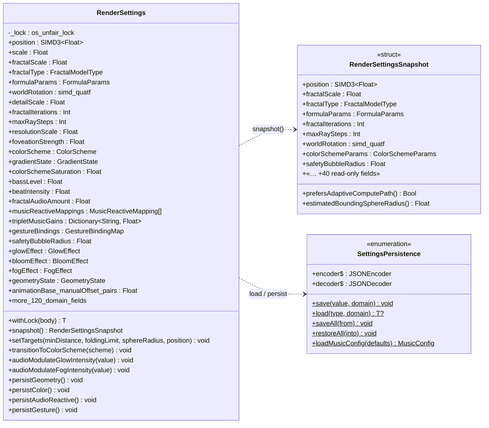
```mermaid
classDiagram
    direction LR

    class RenderSettings {
        -_lock : os_unfair_lock
        +position : SIMD3~Float~
        +scale : Float
        +fractalScale : Float
        +fractalType : FractalModelType
        +formulaParams : FormulaParams
        +worldRotation : simd_quatf
        +detailScale : Float
        +fractalIterations : Int
        +maxRaySteps : Int
        +resolutionScale : Float
        +foveationStrength : Float
        +colorScheme : ColorScheme
        +gradientState : GradientState
        +colorSchemeSaturation : Float
        +bassLevel : Float
        +beatIntensity : Float
        +fractalAudioAmount : Float
        +musicReactiveMappings : MusicReactiveMapping[]
        +tripletMusicGains : Dictionary~String, Float~
        +gestureBindings : GestureBindingMap
        +safetyBubbleRadius : Float
        +glowEffect : GlowEffect
        +bloomEffect : BloomEffect
        +fogEffect : FogEffect
        +geometryState : GeometryState
        +animationBase_manualOffset_pairs : Float
        +more_120_domain_fields
        +withLock(body) T
        +snapshot() RenderSettingsSnapshot
        +setTargets(minDistance, foldingLimit, sphereRadius, position) void
        +transitionToColorScheme(scheme) void
        +audioModulateGlowIntensity(value) void
        +audioModulateFogIntensity(value) void
        +persistGeometry() void
        +persistColor() void
        +persistAudioReactive() void
        +persistGesture() void
    }
    class RenderSettingsSnapshot {
        <<struct>>
        +position : SIMD3~Float~
        +fractalScale : Float
        +fractalType : FractalModelType
        +formulaParams : FormulaParams
        +fractalIterations : Int
        +maxRaySteps : Int
        +worldRotation : simd_quatf
        +colorSchemeParams : ColorSchemeParams
        +safetyBubbleRadius : Float
        +«… +40 read-only fields»
        +prefersAdaptiveComputePath() Bool
        +estimatedBoundingSphereRadius() Float
    }
    class SettingsPersistence {
        <<enumeration>>
        +encoder$ : JSONEncoder
        +decoder$ : JSONDecoder
        +save(value, domain)$ void
        +load(type, domain)$ T?
        +saveAll(from)$ void
        +restoreAll(into)$ void
        +loadMusicConfig(defaults)$ MusicConfig
    }

    RenderSettings ..> RenderSettingsSnapshot : snapshot()
    RenderSettings ..> SettingsPersistence : load / persist
```

```mermaid
classDiagram
    direction TB

    class GeometryConfig {
        <<struct>>
        +fractalType : FractalModelType
        +formulaParams : FormulaParams
        +minDistance : Float
        +fractalScale : Float
        +foldingLimit : Float
        +sphereRadius : Float
        +position : SIMD3~Float~
        +scale : Float
        +worldRotation : simd_quatf
        +detailScale : Float
        +clamp() void
    }
    class ColorConfig {
        <<struct>>
        +colorScheme : ColorScheme
        +gradientState : GradientState
        +colorMix : Float
        +colorSchemeSaturation : Float
        +colorSchemeContrast : Float
        +colorSchemeGamma : Float
        +cellShadingEnabled : Bool
        +colorSchemeAutoTransition : Bool
        +clamp() void
    }
    class LightingConfig {
        <<struct>>
        +lightingPreset : LightingPreset
        +hueRotationEffect : HueRotationEffect
        +pulseEffect : PulseEffect
        +glowEffect : GlowEffect
        +bloomEffect : BloomEffect
        +fogEffect : FogEffect
        +gradientCycleEffect : GradientCycleEffect
        +beatFlashEffect : BeatFlashEffect
        +polarRotationEffect : PolarRotationEffect
        +juliaDriftEffect : JuliaDriftEffect
    }
    class QualityConfig {
        <<struct>>
        +baseFractalIterations : Int
        +baseMaxRaySteps : Int
        +resolutionScale : Float
        +renderQuality : Float
        +tileSize : Int
        +coherentPacketEnabled : Bool
        +foveationStrength : Float
        +smartAdvanceEnabled : Bool
        +clamp() void
    }
    class DisplayConfig {
        <<struct>>
        +showMusicShortcuts : Bool
        +lightingMode : LightingMode
        +sphericalInversionMode : SphericalInversionMode
        +sphericalInversionRadius : Float
        +sphereProjectionEnabled : Bool
        +sphereProjectionBlend : Float
        +platformRadius : Float
        +platformEnabled : Bool
    }
    class AudioReactiveConfig {
        <<struct>>
        +fractalAudioReactiveEnabled : Bool
        +fractalAudioAmount : Float
        +fractalBeatPunch : Float
        +fractalAudioDamping : Float
        +bassSensitivity : Float
        +beatSensitivity : Float
        +musicReactiveMappings : MusicReactiveMapping[]
        +tripletMusicGains : Dictionary~String, Float~
        +clamp() void
    }
    class GestureConfig {
        <<struct>>
        +gestureBindings : GestureBindingMap
        +gestureSensitivity : Float
        +gestureSmoothing : Float
        +menuToggleGestureMode : MenuToggleGestureMode
        +perFingerTapLeftActions : PerFingerTapAction[]
        +perFingerTapRightActions : PerFingerTapAction[]
        +twoHandPinchActivateThreshold : Float
        +«… +18 tuning fields»
        +clamp() void
    }
    class SafetyBubbleConfig {
        <<struct>>
        +enabled : Bool
        +radius : Float
        +shape : Float
        +fadeEnabled : Bool
        +fadeWidth : Float
        +strength : Float
        +clamp() void
    }

    SettingsPersistence ..> GeometryConfig
    SettingsPersistence ..> ColorConfig
    SettingsPersistence ..> LightingConfig
    SettingsPersistence ..> QualityConfig
    SettingsPersistence ..> DisplayConfig
    SettingsPersistence ..> AudioReactiveConfig
    SettingsPersistence ..> GestureConfig
    SettingsPersistence ..> SafetyBubbleConfig
```

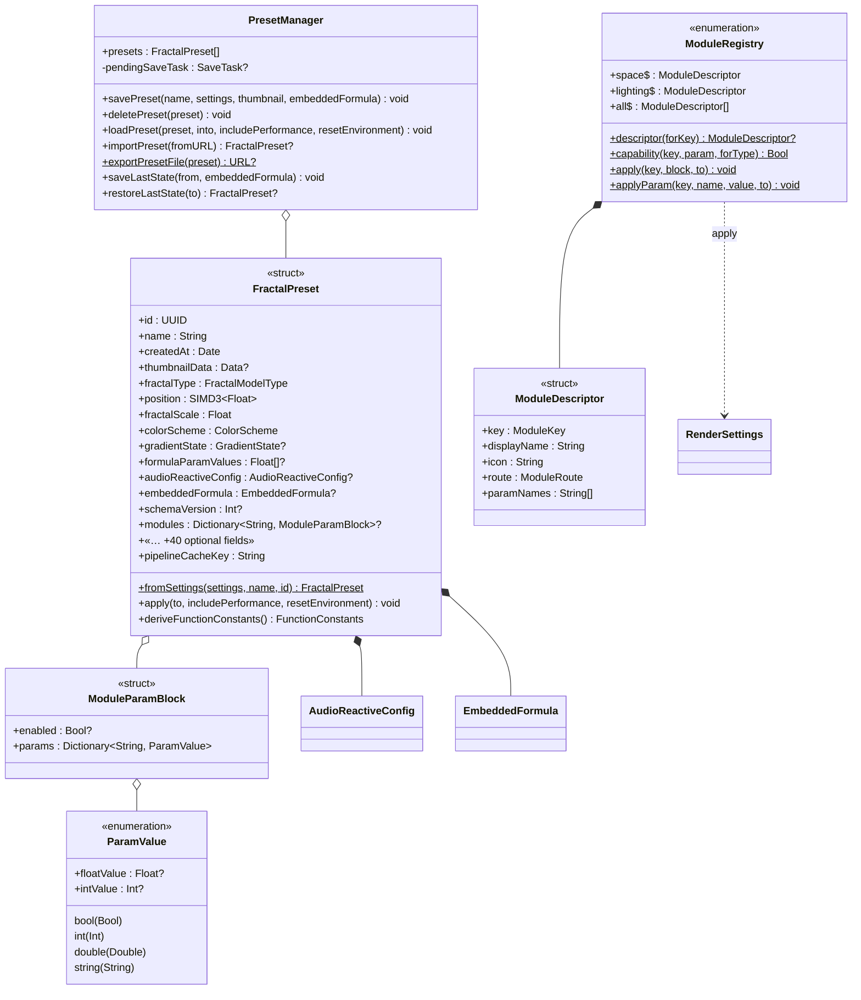
```mermaid
classDiagram
    direction TB

    class PresetManager {
        +presets : FractalPreset[]
        -pendingSaveTask : SaveTask?
        +savePreset(name, settings, thumbnail, embeddedFormula) void
        +deletePreset(preset) void
        +loadPreset(preset, into, includePerformance, resetEnvironment) void
        +importPreset(fromURL) FractalPreset?
        +exportPresetFile(preset)$ URL?
        +saveLastState(from, embeddedFormula) void
        +restoreLastState(to) FractalPreset?
    }
    class FractalPreset {
        <<struct>>
        +id : UUID
        +name : String
        +createdAt : Date
        +thumbnailData : Data?
        +fractalType : FractalModelType
        +position : SIMD3~Float~
        +fractalScale : Float
        +colorScheme : ColorScheme
        +gradientState : GradientState?
        +formulaParamValues : Float[]?
        +audioReactiveConfig : AudioReactiveConfig?
        +embeddedFormula : EmbeddedFormula?
        +schemaVersion : Int?
        +modules : Dictionary~String, ModuleParamBlock~?
        +«… +40 optional fields»
        +fromSettings(settings, name, id)$ FractalPreset
        +apply(to, includePerformance, resetEnvironment) void
        +deriveFunctionConstants() FunctionConstants
        +pipelineCacheKey : String
    }
    class ModuleRegistry {
        <<enumeration>>
        +space$ : ModuleDescriptor
        +lighting$ : ModuleDescriptor
        +all$ : ModuleDescriptor[]
        +descriptor(forKey)$ ModuleDescriptor?
        +capability(key, param, forType)$ Bool
        +apply(key, block, to)$ void
        +applyParam(key, name, value, to)$ void
    }
    class ModuleDescriptor {
        <<struct>>
        +key : ModuleKey
        +displayName : String
        +icon : String
        +route : ModuleRoute
        +paramNames : String[]
    }
    class ModuleParamBlock {
        <<struct>>
        +enabled : Bool?
        +params : Dictionary~String, ParamValue~
    }
    class ParamValue {
        <<enumeration>>
        bool(Bool)
        int(Int)
        double(Double)
        string(String)
        +floatValue : Float?
        +intValue : Int?
    }

    PresetManager o-- FractalPreset
    FractalPreset o-- ModuleParamBlock
    FractalPreset *-- AudioReactiveConfig
    FractalPreset *-- EmbeddedFormula
    ModuleParamBlock o-- ParamValue
    ModuleRegistry *-- ModuleDescriptor
    ModuleRegistry ..> RenderSettings : apply
```

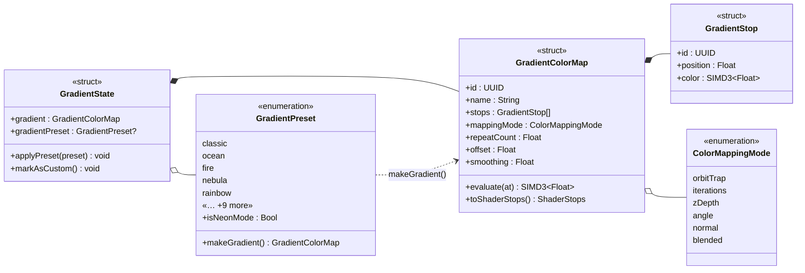
```mermaid
classDiagram
    direction LR

    class GradientState {
        <<struct>>
        +gradient : GradientColorMap
        +gradientPreset : GradientPreset?
        +applyPreset(preset) void
        +markAsCustom() void
    }
    class GradientColorMap {
        <<struct>>
        +id : UUID
        +name : String
        +stops : GradientStop[]
        +mappingMode : ColorMappingMode
        +repeatCount : Float
        +offset : Float
        +smoothing : Float
        +evaluate(at) SIMD3~Float~
        +toShaderStops() ShaderStops
    }
    class GradientStop {
        <<struct>>
        +id : UUID
        +position : Float
        +color : SIMD3~Float~
    }
    class GradientPreset {
        <<enumeration>>
        classic
        ocean
        fire
        nebula
        rainbow
        «… +9 more»
        +makeGradient() GradientColorMap
        +isNeonMode : Bool
    }
    class ColorMappingMode {
        <<enumeration>>
        orbitTrap
        iterations
        zDepth
        angle
        normal
        blended
    }

    GradientState *-- GradientColorMap
    GradientState o-- GradientPreset
    GradientColorMap *-- GradientStop
    GradientColorMap o-- ColorMappingMode
    GradientPreset ..> GradientColorMap : makeGradient()
```

---

## 4. Rendering

`Renderer` is one `actor` whose methods live across ~15 `Renderer*.swift` extensions (grouped below by
area in comments). Stored properties live in the main file.

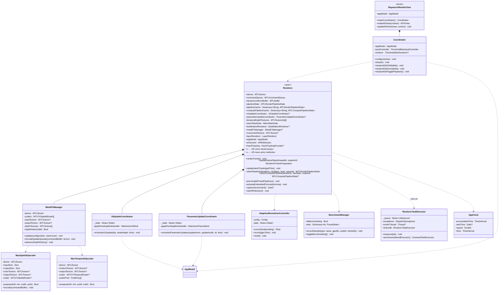
```mermaid
classDiagram
    direction TB

    class Renderer {
        <<actor>>
        +device : MTLDevice
        +commandQueue : MTLCommandQueue
        +dynamicUniformBuffer : MTLBuffer
        +pipelineState : MTLRenderPipelineState
        +pipelineCache : Dictionary~String, MTLRenderPipelineState~
        +computePipelineCache : Dictionary~String, MTLComputePipelineState~
        +uiUpdateCoordinator : UIUpdateCoordinator?
        +parameterUpdateCoordinator : ParameterUpdateCoordinator?
        +temporalDepthTextures : MTLTextureOpt[]
        +warmStartGate : WarmStartGate
        +buddhabrotRenderer : BuddhabrotRenderer?
        +metalFXManager : MetalFXManager?
        +screenshotTexture : MTLTexture?
        +layerRenderer : LayerRenderer
        +appModel : AppModel
        +arSession : ARKitSession
        +handTracking : HandTrackingProvider?
        +«… +35 more stored props»
        +renderFrame() void
        +updateGameState(drawable, snapshot) RendererFramePreparation
        +updateHandTracking(atTime) void
        +selectPipeline(iterations, raySteps, neon, request) MTLRenderPipelineState
        +selectComputePipeline(iterations, raySteps, request) MTLComputePipelineState?
        +precompilePresetPipelines() void
        +activateEmbeddedFormula(formula) void
        +captureScreenshot() Data?
        +startARSession() void
        +«… +25 more actor methods»
    }
    class RaymarchRenderView {
        <<struct>>
        +appModel : AppModel
        +makeCoordinator() Coordinator
        +makeNSView(context) MTKView
        +updateNSView(view, context) void
    }
    class Coordinator {
        +appModel : AppModel
        -inputController : ThresholdMacInputController
        -renderer : ThresholdMacRenderer?
        +configure(view) void
        +draw(in) void
        +viewportDidOrbit(delta) void
        +viewportDidZoom(delta) void
        +viewportDidTogglePlayback() void
    }
    class MetalFXManager {
        -device : MTLDevice
        -scalers : MTLFXSpatialScaler[]
        -inputTexture : MTLTexture?
        -outputTexture : MTLTexture?
        -depthTextures : MTLTexture[]
        +depthHistoryValid : Bool
        +update(configuration, viewCount) void
        +encodeSpatialUpscale(commandBuffer, fence) void
        +advanceDepthHistory() void
    }
    class MacSpatialUpscaler {
        -device : MTLDevice
        +inputSize : Size
        +outputSize : Size
        +colorTexture : MTLTexture?
        +outputTexture : MTLTexture?
        -scaler : MTLFXSpatialScaler?
        +prepare(inW, inH, outW, outH) Bool
        +encode(commandBuffer) void
    }
    class MacTemporalUpscaler {
        -device : MTLDevice
        +motionTexture : MTLTexture?
        +outputTexture : MTLTexture?
        -scaler : MTLFXTemporalScaler?
        -scalerPool : PoolEntry[]
        +prepare(inW, inH, outW, outH) Bool
    }
    class AdaptiveResolutionController {
        -config : Config
        -state : Mutex~State~
        +currentScale(ceiling) Float
        +record(gpuTime) void
        +reset() void
    }
    class BenchmarkManager {
        +isBenchmarking : Bool
        -stats : Dictionary~Int, FractalStats~
        +recordSample(type, name, gpuMs, cpuMs, frameMs) void
        +toggleBenchmarking() void
    }
    class RendererTaskExecutor {
        -_queue : Mutex~JobQueue~
        -semaphore : DispatchSemaphore
        -renderThread : Thread?
        +shared$ : RendererTaskExecutor
        +enqueue(job) void
        +asUnownedSerialExecutor() UnownedTaskExecutor
    }
    class UIUpdateCoordinator {
        -_state : Mutex~State~
        -applyPendingWorkHandler : MainActorUIWork
        +scheduleUIUpdate(fps, headHeight, time) void
    }
    class ParameterUpdateCoordinator {
        -_state : Mutex~State~
        -applyPendingWorkHandler : MainActorParamWork
        +scheduleParameterUpdates(updateAnim, updateAudio, dt, time) void
    }
    class AppClock {
        -accumulatedTime : TimeInterval
        -startTime : Date?
        +speed : Double
        +time : TimeInterval
    }

    RaymarchRenderView *-- Coordinator
    Coordinator ..> Renderer
    Coordinator ..> AppModel
    Renderer *-- MetalFXManager
    Renderer *-- UIUpdateCoordinator
    Renderer *-- ParameterUpdateCoordinator
    Renderer ..> AdaptiveResolutionController
    Renderer ..> BenchmarkManager
    Renderer ..> RendererTaskExecutor : runs on
    Renderer ..> AppClock
    MetalFXManager ..> MacSpatialUpscaler
    MetalFXManager ..> MacTemporalUpscaler
    UIUpdateCoordinator ..> AppModel
    ParameterUpdateCoordinator ..> AppModel
```

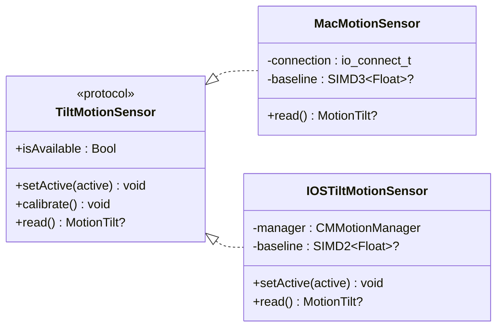
```mermaid
classDiagram
    direction LR

    class TiltMotionSensor {
        <<protocol>>
        +isAvailable : Bool
        +setActive(active) void
        +calibrate() void
        +read() MotionTilt?
    }
    class MacMotionSensor {
        -connection : io_connect_t
        -baseline : SIMD3~Float~?
        +read() MotionTilt?
    }
    class IOSTiltMotionSensor {
        -manager : CMMotionManager
        -baseline : SIMD2~Float~?
        +setActive(active) void
        +read() MotionTilt?
    }

    TiltMotionSensor <|.. MacMotionSensor
    TiltMotionSensor <|.. IOSTiltMotionSensor
```

---

## 5. Gestures

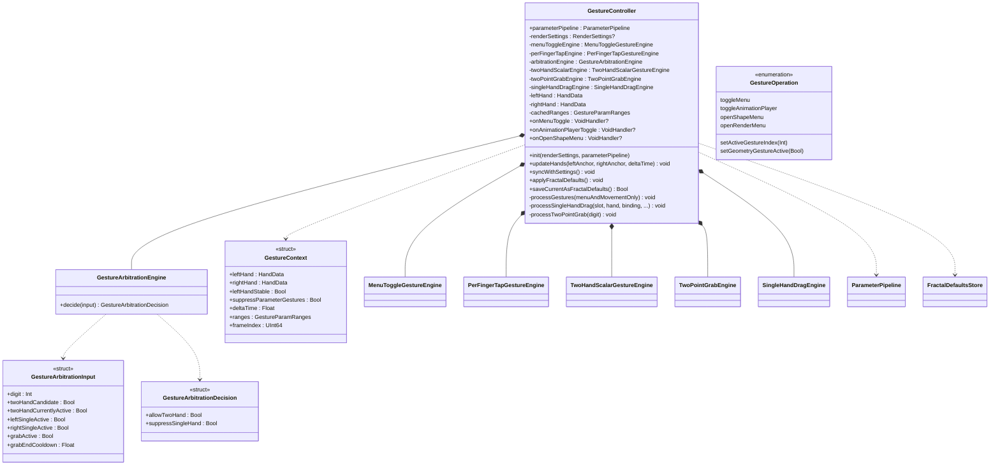
```mermaid
classDiagram
    direction TB

    class GestureController {
        +parameterPipeline : ParameterPipeline
        -renderSettings : RenderSettings?
        -menuToggleEngine : MenuToggleGestureEngine
        -perFingerTapEngine : PerFingerTapGestureEngine
        -arbitrationEngine : GestureArbitrationEngine
        -twoHandScalarEngine : TwoHandScalarGestureEngine
        -twoPointGrabEngine : TwoPointGrabEngine
        -singleHandDragEngine : SingleHandDragEngine
        -leftHand : HandData
        -rightHand : HandData
        -cachedRanges : GestureParamRanges
        +onMenuToggle : VoidHandler?
        +onAnimationPlayerToggle : VoidHandler?
        +onOpenShapeMenu : VoidHandler?
        +init(renderSettings, parameterPipeline)
        +updateHands(leftAnchor, rightAnchor, deltaTime) void
        +syncWithSettings() void
        +applyFractalDefaults() void
        +saveCurrentAsFractalDefaults() Bool
        -processGestures(menuAndMovementOnly) void
        -processSingleHandDrag(slot, hand, binding, ...) void
        -processTwoPointGrab(digit) void
    }
    class GestureArbitrationEngine {
        +decide(input) GestureArbitrationDecision
    }
    class GestureArbitrationInput {
        <<struct>>
        +digit : Int
        +twoHandCandidate : Bool
        +twoHandCurrentlyActive : Bool
        +leftSingleActive : Bool
        +rightSingleActive : Bool
        +grabActive : Bool
        +grabEndCooldown : Float
    }
    class GestureArbitrationDecision {
        <<struct>>
        +allowTwoHand : Bool
        +suppressSingleHand : Bool
    }
    class GestureContext {
        <<struct>>
        +leftHand : HandData
        +rightHand : HandData
        +leftHandStable : Bool
        +suppressParameterGestures : Bool
        +deltaTime : Float
        +ranges : GestureParamRanges
        +frameIndex : UInt64
    }
    class GestureOperation {
        <<enumeration>>
        toggleMenu
        toggleAnimationPlayer
        openShapeMenu
        openRenderMenu
        setActiveGestureIndex(Int)
        setGeometryGestureActive(Bool)
    }

    GestureController *-- MenuToggleGestureEngine
    GestureController *-- PerFingerTapGestureEngine
    GestureController *-- GestureArbitrationEngine
    GestureController *-- TwoHandScalarGestureEngine
    GestureController *-- TwoPointGrabEngine
    GestureController *-- SingleHandDragEngine
    GestureController ..> GestureContext
    GestureController ..> ParameterPipeline
    GestureController ..> FractalDefaultsStore
    GestureArbitrationEngine ..> GestureArbitrationInput
    GestureArbitrationEngine ..> GestureArbitrationDecision
```

Each engine owns a state struct and exposes `process(context, settings) -> [GestureOperation]` (or
`reset()`):

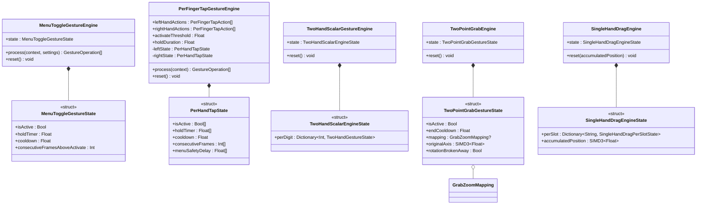
```mermaid
classDiagram
    direction TB

    class MenuToggleGestureEngine {
        +state : MenuToggleGestureState
        +process(context, settings) GestureOperation[]
        +reset() void
    }
    class MenuToggleGestureState {
        <<struct>>
        +isActive : Bool
        +holdTimer : Float
        +cooldown : Float
        +consecutiveFramesAboveActivate : Int
    }
    class PerFingerTapGestureEngine {
        +leftHandActions : PerFingerTapAction[]
        +rightHandActions : PerFingerTapAction[]
        +activateThreshold : Float
        +holdDuration : Float
        -leftState : PerHandTapState
        -rightState : PerHandTapState
        +process(context) GestureOperation[]
        +reset() void
    }
    class PerHandTapState {
        <<struct>>
        +isActive : Bool[]
        +holdTimer : Float[]
        +cooldown : Float
        +consecutiveFrames : Int[]
        +menuSafetyDelay : Float[]
    }
    class TwoHandScalarGestureEngine {
        +state : TwoHandScalarEngineState
        +reset() void
    }
    class TwoHandScalarEngineState {
        <<struct>>
        +perDigit : Dictionary~Int, TwoHandGestureState~
    }
    class TwoPointGrabEngine {
        +state : TwoPointGrabGestureState
        +reset() void
    }
    class TwoPointGrabGestureState {
        <<struct>>
        +isActive : Bool
        +endCooldown : Float
        +mapping : GrabZoomMapping?
        +originalAxis : SIMD3~Float~
        +rotationBrokenAway : Bool
    }
    class SingleHandDragEngine {
        +state : SingleHandDragEngineState
        +reset(accumulatedPosition) void
    }
    class SingleHandDragEngineState {
        <<struct>>
        +perSlot : Dictionary~String, SingleHandDragPerSlotState~
        +accumulatedPosition : SIMD3~Float~
    }

    MenuToggleGestureEngine *-- MenuToggleGestureState
    PerFingerTapGestureEngine *-- PerHandTapState
    TwoHandScalarGestureEngine *-- TwoHandScalarEngineState
    TwoPointGrabEngine *-- TwoPointGrabGestureState
    SingleHandDragEngine *-- SingleHandDragEngineState
    TwoPointGrabGestureState o-- GrabZoomMapping
```

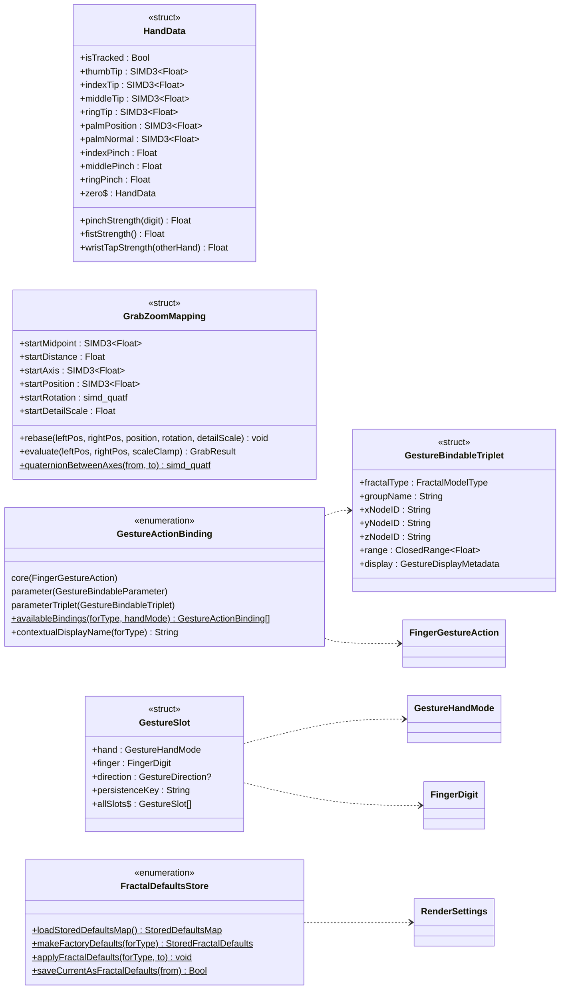
```mermaid
classDiagram
    direction LR

    class HandData {
        <<struct>>
        +isTracked : Bool
        +thumbTip : SIMD3~Float~
        +indexTip : SIMD3~Float~
        +middleTip : SIMD3~Float~
        +ringTip : SIMD3~Float~
        +palmPosition : SIMD3~Float~
        +palmNormal : SIMD3~Float~
        +indexPinch : Float
        +middlePinch : Float
        +ringPinch : Float
        +pinchStrength(digit) Float
        +fistStrength() Float
        +wristTapStrength(otherHand) Float
        +zero$ : HandData
    }
    class GrabZoomMapping {
        <<struct>>
        +startMidpoint : SIMD3~Float~
        +startDistance : Float
        +startAxis : SIMD3~Float~
        +startPosition : SIMD3~Float~
        +startRotation : simd_quatf
        +startDetailScale : Float
        +rebase(leftPos, rightPos, position, rotation, detailScale) void
        +evaluate(leftPos, rightPos, scaleClamp) GrabResult
        +quaternionBetweenAxes(from, to)$ simd_quatf
    }
    class GestureActionBinding {
        <<enumeration>>
        core(FingerGestureAction)
        parameter(GestureBindableParameter)
        parameterTriplet(GestureBindableTriplet)
        +availableBindings(forType, handMode)$ GestureActionBinding[]
        +contextualDisplayName(forType) String
    }
    class GestureSlot {
        <<struct>>
        +hand : GestureHandMode
        +finger : FingerDigit
        +direction : GestureDirection?
        +persistenceKey : String
        +allSlots$ : GestureSlot[]
    }
    class GestureBindableTriplet {
        <<struct>>
        +fractalType : FractalModelType
        +groupName : String
        +xNodeID : String
        +yNodeID : String
        +zNodeID : String
        +range : ClosedRange~Float~
        +display : GestureDisplayMetadata
    }
    class FractalDefaultsStore {
        <<enumeration>>
        +loadStoredDefaultsMap()$ StoredDefaultsMap
        +makeFactoryDefaults(forType)$ StoredFractalDefaults
        +applyFractalDefaults(forType, to)$ void
        +saveCurrentAsFractalDefaults(from)$ Bool
    }

    GestureActionBinding ..> GestureBindableTriplet
    GestureActionBinding ..> FingerGestureAction
    GestureSlot ..> GestureHandMode
    GestureSlot ..> FingerDigit
    FractalDefaultsStore ..> RenderSettings
```

---

## 6. Audio

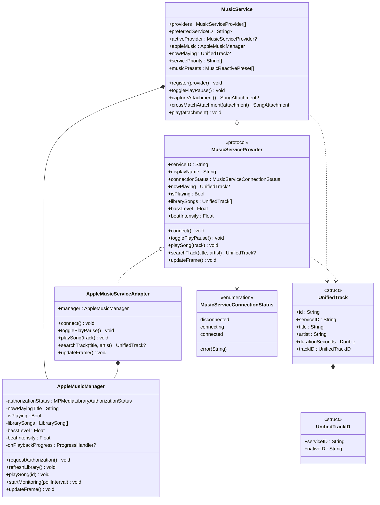
```mermaid
classDiagram
    direction TB

    class MusicServiceProvider {
        <<protocol>>
        +serviceID : String
        +displayName : String
        +connectionStatus : MusicServiceConnectionStatus
        +nowPlaying : UnifiedTrack?
        +isPlaying : Bool
        +librarySongs : UnifiedTrack[]
        +bassLevel : Float
        +beatIntensity : Float
        +connect() void
        +togglePlayPause() void
        +playSong(track) void
        +searchTrack(title, artist) UnifiedTrack?
        +updateFrame() void
    }
    class MusicService {
        +providers : MusicServiceProvider[]
        +preferredServiceID : String?
        +activeProvider : MusicServiceProvider?
        +appleMusic : AppleMusicManager
        +nowPlaying : UnifiedTrack?
        +servicePriority : String[]
        +musicPresets : MusicReactivePreset[]
        +register(provider) void
        +togglePlayPause() void
        +captureAttachment() SongAttachment?
        +crossMatchAttachment(attachment) SongAttachment
        +play(attachment) void
    }
    class AppleMusicServiceAdapter {
        +manager : AppleMusicManager
        +connect() void
        +togglePlayPause() void
        +playSong(track) void
        +searchTrack(title, artist) UnifiedTrack?
        +updateFrame() void
    }
    class AppleMusicManager {
        -authorizationStatus : MPMediaLibraryAuthorizationStatus
        -nowPlayingTitle : String
        -isPlaying : Bool
        -librarySongs : LibrarySong[]
        -bassLevel : Float
        -beatIntensity : Float
        -onPlaybackProgress : ProgressHandler?
        +requestAuthorization() void
        +refreshLibrary() void
        +playSong(id) void
        +startMonitoring(pollInterval) void
        +updateFrame() void
    }
    class UnifiedTrack {
        <<struct>>
        +id : String
        +serviceID : String
        +title : String
        +artist : String
        +durationSeconds : Double
        +trackID : UnifiedTrackID
    }
    class UnifiedTrackID {
        <<struct>>
        +serviceID : String
        +nativeID : String
    }
    class MusicServiceConnectionStatus {
        <<enumeration>>
        disconnected
        connecting
        connected
        error(String)
    }

    MusicServiceProvider <|.. AppleMusicServiceAdapter
    MusicService o-- MusicServiceProvider
    MusicService *-- AppleMusicManager
    AppleMusicServiceAdapter *-- AppleMusicManager
    MusicService ..> UnifiedTrack
    MusicServiceProvider ..> UnifiedTrack
    UnifiedTrack *-- UnifiedTrackID
    MusicServiceProvider ..> MusicServiceConnectionStatus
```

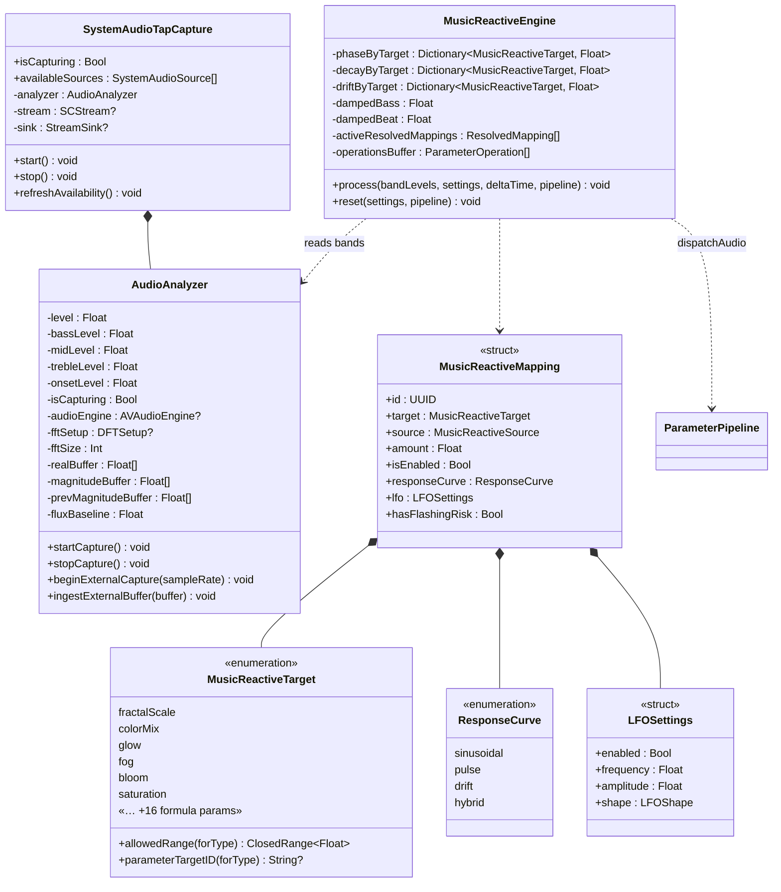
```mermaid
classDiagram
    direction TB

    class AudioAnalyzer {
        -level : Float
        -bassLevel : Float
        -midLevel : Float
        -trebleLevel : Float
        -onsetLevel : Float
        -isCapturing : Bool
        -audioEngine : AVAudioEngine?
        -fftSetup : DFTSetup?
        -fftSize : Int
        -realBuffer : Float[]
        -magnitudeBuffer : Float[]
        -prevMagnitudeBuffer : Float[]
        -fluxBaseline : Float
        +startCapture() void
        +stopCapture() void
        +beginExternalCapture(sampleRate) void
        +ingestExternalBuffer(buffer) void
    }
    class SystemAudioTapCapture {
        +isCapturing : Bool
        +availableSources : SystemAudioSource[]
        -analyzer : AudioAnalyzer
        -stream : SCStream?
        -sink : StreamSink?
        +start() void
        +stop() void
        +refreshAvailability() void
    }
    class MusicReactiveEngine {
        -phaseByTarget : Dictionary~MusicReactiveTarget, Float~
        -decayByTarget : Dictionary~MusicReactiveTarget, Float~
        -driftByTarget : Dictionary~MusicReactiveTarget, Float~
        -dampedBass : Float
        -dampedBeat : Float
        -activeResolvedMappings : ResolvedMapping[]
        -operationsBuffer : ParameterOperation[]
        +process(bandLevels, settings, deltaTime, pipeline) void
        +reset(settings, pipeline) void
    }
    class MusicReactiveMapping {
        <<struct>>
        +id : UUID
        +target : MusicReactiveTarget
        +source : MusicReactiveSource
        +amount : Float
        +isEnabled : Bool
        +responseCurve : ResponseCurve
        +lfo : LFOSettings
        +hasFlashingRisk : Bool
    }
    class MusicReactiveTarget {
        <<enumeration>>
        fractalScale
        colorMix
        glow
        fog
        bloom
        saturation
        «… +16 formula params»
        +allowedRange(forType) ClosedRange~Float~
        +parameterTargetID(forType) String?
    }
    class ResponseCurve {
        <<enumeration>>
        sinusoidal
        pulse
        drift
        hybrid
    }
    class LFOSettings {
        <<struct>>
        +enabled : Bool
        +frequency : Float
        +amplitude : Float
        +shape : LFOShape
    }

    SystemAudioTapCapture *-- AudioAnalyzer
    MusicReactiveEngine ..> AudioAnalyzer : reads bands
    MusicReactiveEngine ..> ParameterPipeline : dispatchAudio
    MusicReactiveEngine ..> MusicReactiveMapping
    MusicReactiveMapping *-- MusicReactiveTarget
    MusicReactiveMapping *-- ResponseCurve
    MusicReactiveMapping *-- LFOSettings
```

---

## 7. Animation

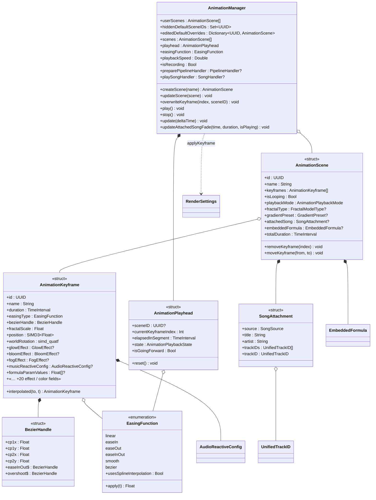
```mermaid
classDiagram
    direction TB

    class AnimationManager {
        +userScenes : AnimationScene[]
        +hiddenDefaultSceneIDs : Set~UUID~
        +editedDefaultOverrides : Dictionary~UUID, AnimationScene~
        +scenes : AnimationScene[]
        +playhead : AnimationPlayhead
        +easingFunction : EasingFunction
        +playbackSpeed : Double
        +isRecording : Bool
        +preparePipelineHandler : PipelineHandler?
        +playSongHandler : SongHandler?
        +createScene(name) AnimationScene
        +updateScene(scene) void
        +overwriteKeyframe(index, sceneID) void
        +play() void
        +stop() void
        +update(deltaTime) void
        +updateAttachedSongFade(time, duration, isPlaying) void
    }
    class AnimationScene {
        <<struct>>
        +id : UUID
        +name : String
        +keyframes : AnimationKeyframe[]
        +isLooping : Bool
        +playbackMode : AnimationPlaybackMode
        +fractalType : FractalModelType?
        +gradientPreset : GradientPreset?
        +attachedSong : SongAttachment?
        +embeddedFormula : EmbeddedFormula?
        +totalDuration : TimeInterval
        +removeKeyframe(index) void
        +moveKeyframe(from, to) void
    }
    class AnimationKeyframe {
        <<struct>>
        +id : UUID
        +name : String
        +duration : TimeInterval
        +easingType : EasingFunction
        +bezierHandle : BezierHandle
        +fractalScale : Float
        +position : SIMD3~Float~
        +worldRotation : simd_quatf
        +glowEffect : GlowEffect?
        +bloomEffect : BloomEffect?
        +fogEffect : FogEffect?
        +musicReactiveConfig : AudioReactiveConfig?
        +formulaParamValues : Float[]?
        +«… +20 effect / color fields»
        +interpolated(to, t) AnimationKeyframe
    }
    class AnimationPlayhead {
        <<struct>>
        +sceneID : UUID?
        +currentKeyframeIndex : Int
        +elapsedInSegment : TimeInterval
        +state : AnimationPlaybackState
        +isGoingForward : Bool
        +reset() void
    }
    class EasingFunction {
        <<enumeration>>
        linear
        easeIn
        easeOut
        easeInOut
        smooth
        bezier
        +apply(t) Float
        +usesSplineInterpolation : Bool
    }
    class BezierHandle {
        <<struct>>
        +cp1x : Float
        +cp1y : Float
        +cp2x : Float
        +cp2y : Float
        +easeInOut$ : BezierHandle
        +overshoot$ : BezierHandle
    }
    class SongAttachment {
        <<struct>>
        +source : SongSource
        +title : String
        +artist : String
        +trackIDs : UnifiedTrackID[]
        +trackID : UnifiedTrackID
    }

    AnimationManager o-- AnimationScene
    AnimationManager *-- AnimationPlayhead
    AnimationManager ..> RenderSettings : applyKeyframe
    AnimationScene o-- AnimationKeyframe
    AnimationScene *-- SongAttachment
    AnimationScene *-- EmbeddedFormula
    AnimationKeyframe *-- BezierHandle
    AnimationKeyframe o-- EasingFunction
    AnimationKeyframe *-- AudioReactiveConfig
    AnimationPlayhead o-- EasingFunction
    SongAttachment o-- UnifiedTrackID
```

---

## 8. Formulas

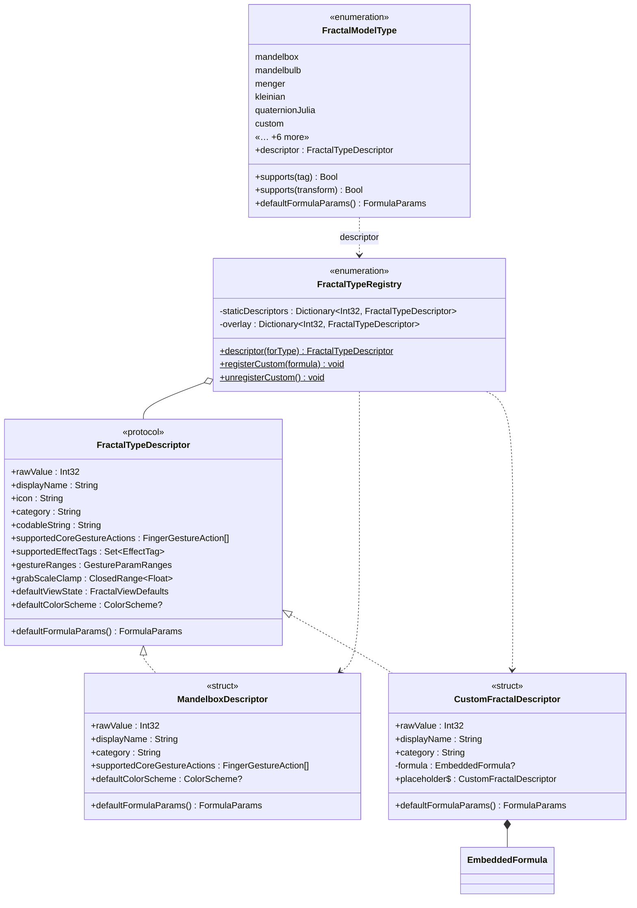
```mermaid
classDiagram
    direction TB

    class FractalTypeDescriptor {
        <<protocol>>
        +rawValue : Int32
        +displayName : String
        +icon : String
        +category : String
        +codableString : String
        +supportedCoreGestureActions : FingerGestureAction[]
        +supportedEffectTags : Set~EffectTag~
        +gestureRanges : GestureParamRanges
        +grabScaleClamp : ClosedRange~Float~
        +defaultViewState : FractalViewDefaults
        +defaultColorScheme : ColorScheme?
        +defaultFormulaParams() FormulaParams
    }
    class FractalModelType {
        <<enumeration>>
        mandelbox
        mandelbulb
        menger
        kleinian
        quaternionJulia
        custom
        «… +6 more»
        +descriptor : FractalTypeDescriptor
        +supports(tag) Bool
        +supports(transform) Bool
        +defaultFormulaParams() FormulaParams
    }
    class FractalTypeRegistry {
        <<enumeration>>
        -staticDescriptors : Dictionary~Int32, FractalTypeDescriptor~
        -overlay : Dictionary~Int32, FractalTypeDescriptor~
        +descriptor(forType)$ FractalTypeDescriptor
        +registerCustom(formula)$ void
        +unregisterCustom()$ void
    }
    class MandelboxDescriptor {
        <<struct>>
        +rawValue : Int32
        +displayName : String
        +category : String
        +supportedCoreGestureActions : FingerGestureAction[]
        +defaultColorScheme : ColorScheme?
        +defaultFormulaParams() FormulaParams
    }
    class CustomFractalDescriptor {
        <<struct>>
        +rawValue : Int32
        +displayName : String
        +category : String
        -formula : EmbeddedFormula?
        +placeholder$ : CustomFractalDescriptor
        +defaultFormulaParams() FormulaParams
    }

    FractalTypeDescriptor <|.. MandelboxDescriptor
    FractalTypeDescriptor <|.. CustomFractalDescriptor
    FractalModelType ..> FractalTypeRegistry : descriptor
    FractalTypeRegistry o-- FractalTypeDescriptor
    FractalTypeRegistry ..> MandelboxDescriptor
    FractalTypeRegistry ..> CustomFractalDescriptor
    CustomFractalDescriptor *-- EmbeddedFormula
```

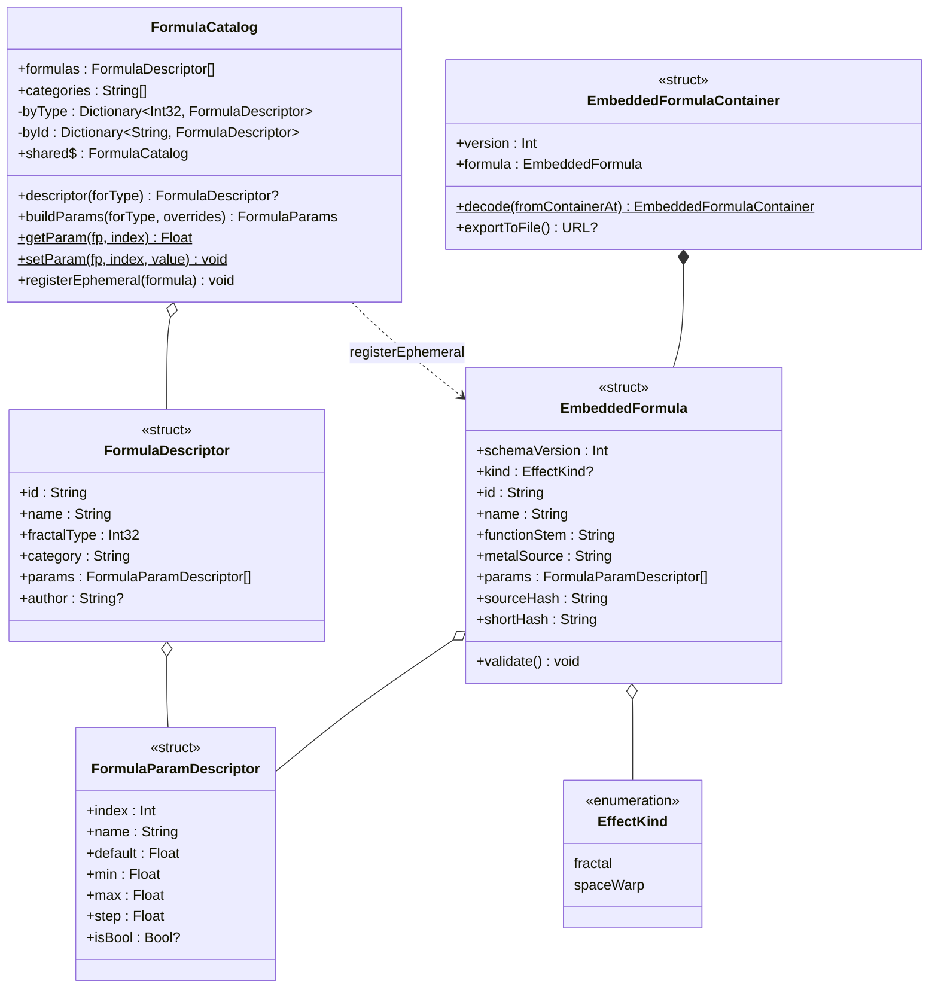
```mermaid
classDiagram
    direction TB

    class FormulaCatalog {
        +formulas : FormulaDescriptor[]
        +categories : String[]
        -byType : Dictionary~Int32, FormulaDescriptor~
        -byId : Dictionary~String, FormulaDescriptor~
        +shared$ : FormulaCatalog
        +descriptor(forType) FormulaDescriptor?
        +buildParams(forType, overrides) FormulaParams
        +getParam(fp, index)$ Float
        +setParam(fp, index, value)$ void
        +registerEphemeral(formula) void
    }
    class FormulaDescriptor {
        <<struct>>
        +id : String
        +name : String
        +fractalType : Int32
        +category : String
        +params : FormulaParamDescriptor[]
        +author : String?
    }
    class EmbeddedFormula {
        <<struct>>
        +schemaVersion : Int
        +kind : EffectKind?
        +id : String
        +name : String
        +functionStem : String
        +metalSource : String
        +params : FormulaParamDescriptor[]
        +sourceHash : String
        +shortHash : String
        +validate() void
    }
    class EmbeddedFormulaContainer {
        <<struct>>
        +version : Int
        +formula : EmbeddedFormula
        +decode(fromContainerAt)$ EmbeddedFormulaContainer
        +exportToFile() URL?
    }
    class FormulaParamDescriptor {
        <<struct>>
        +index : Int
        +name : String
        +default : Float
        +min : Float
        +max : Float
        +step : Float
        +isBool : Bool?
    }
    class EffectKind {
        <<enumeration>>
        fractal
        spaceWarp
    }

    FormulaCatalog o-- FormulaDescriptor
    FormulaDescriptor o-- FormulaParamDescriptor
    EmbeddedFormulaContainer *-- EmbeddedFormula
    EmbeddedFormula o-- FormulaParamDescriptor
    EmbeddedFormula o-- EffectKind
    FormulaCatalog ..> EmbeddedFormula : registerEphemeral
```

---

### Notes on fidelity

- **Member lists are trimmed to the meaningful surface.** Where a type has far more members than shown
  (`RenderSettings` ~150 fields, `Renderer` ~50 props / ~45 methods, `AnimationKeyframe` ~45 fields), a
  `… (+N more)` marker stands in — this is standard for UML of large types, not an omission of structure.
- **`Renderer` is a single `actor`** whose implementation is split across `Rendering/Core/Renderer*.swift`
  extensions (setup, frame loop, pipeline cache, custom shader, screenshot, math). They are partials of
  one type, so they're modeled as one class.
- Concrete fractal descriptors: only `MandelboxDescriptor` and `CustomFractalDescriptor` are drawn as
  representatives — there are ~11 more (`MandelbulbDescriptor`, `MengerDescriptor`, `KleinianDescriptor`,
  …) all conforming to `FractalTypeDescriptor` identically.
- Simplified closure type aliases (`VoidHandler`, `AsyncDataHandler`, `PipelineHandler`, …) stand in for
  Swift closure types, which Mermaid can't render in an attribute slot.
